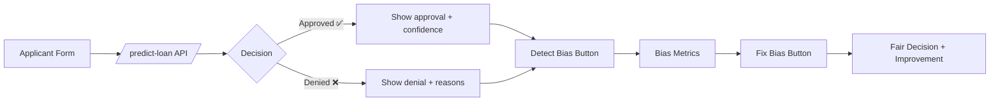
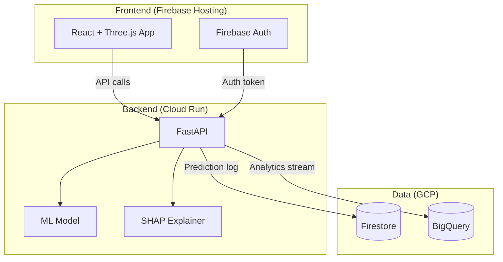
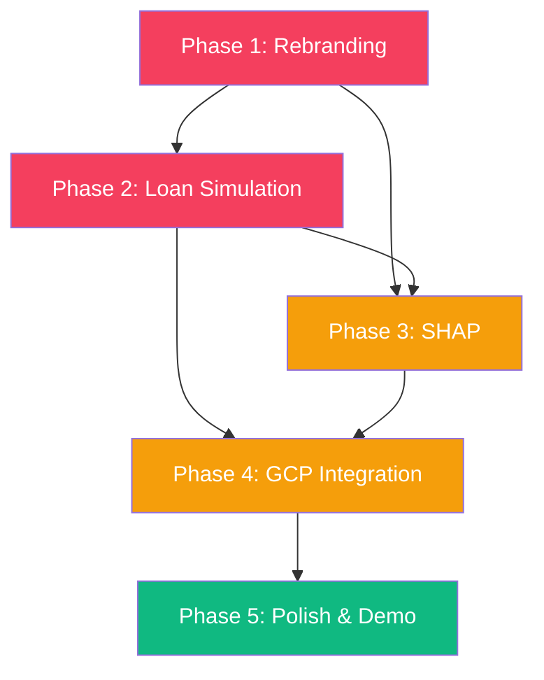

# 🏆 FairLoan AI — Winner Blueprint Roadmap

## 📄 Blueprint Summary

The **FairLoan AI Winner Blueprint** outlines 6 pillars to transform the current "AI Bias Inspector" into a **9–9.5/10 competition-winning** application:

| # | Pillar | Goal |
|---|--------|------|
| 1 | **Project Identity** | Rebrand to "FairLoan AI – Ensuring Fair Access to Credit" |
| 2 | **Product Transformation** | Convert from a generic bias tool → real loan approval system |
| 3 | **User Flow (Demo)** | Applicant input → Loan decision → Bias detection → Fix Bias → Improvement metrics |
| 4 | **Core Features** | Loan prediction, bias detection, mitigation, before/after, SHAP, interactive dashboard |
| 5 | **Google Tech Integration** | Firebase, Cloud Run, BigQuery |
| 6 | **Final Outcome** | Competition-ready at 9–9.5/10 level |

---

## 🔍 Gap Analysis — Current State vs. Blueprint

| Requirement | Current State | Status | Gap |
|-------------|--------------|--------|-----|
| Rebranding to "FairLoan AI" | Still says "AI Bias Inspector" everywhere | 🔴 Not started | Full rebrand needed (header, footer, titles, README) |
| Loan applicant input form | CSV upload only | 🔴 Not started | Need individual applicant form (income, credit score, age, etc.) |
| Loan approval prediction | Model returns bias metrics only | 🟡 Partial | Need explicit approve/deny prediction per applicant |
| Bias detection | ✅ Working (Fairlearn) | 🟢 Done | — |
| Bias mitigation | ✅ ThresholdOptimizer | 🟢 Done | — |
| Before vs After comparison | ✅ Working in results tab | 🟢 Done | — |
| SHAP Explainability | Not present | 🔴 Not started | Need SHAP integration + waterfall/force plots |
| Interactive dashboard | ✅ Glassmorphism + Three.js + Recharts | 🟢 Done | Polish for loan-specific context |
| Firebase integration | Not present | 🔴 Not started | Auth, Firestore, Hosting |
| Cloud Run deployment | Not present | 🔴 Not started | Dockerize backend, deploy to Cloud Run |
| BigQuery integration | Not present | 🔴 Not started | Log predictions & fairness metrics |
| Export reports | ✅ JSON export | 🟢 Done | — |

> [!IMPORTANT]
> **5 out of 12 requirements are not started.** The biggest gaps are: individual loan simulation, SHAP explainability, and Google Cloud integration.

---

## 🗺️ Execution Roadmap — 5 Phases

### Phase 1: Rebranding & Identity *(~1 hour)*
> **Priority: 🔴 Critical** — First impression matters for competition judges

| # | Task | Files Affected | Effort |
|---|------|----------------|--------|
| 1.1 | Rename header from "AI Bias Inspector" → "FairLoan AI" | `Dashboard.jsx` | 10 min |
| 1.2 | Update subtitle to "Ensuring Fair Access to Credit" | `Dashboard.jsx` | 5 min |
| 1.3 | Update footer branding | `Dashboard.jsx` | 5 min |
| 1.4 | Update FastAPI title | `backend/api.py` | 2 min |
| 1.5 | Rewrite `README.md` for FairLoan AI narrative | `README.md` | 20 min |
| 1.6 | Update page `<title>` & meta tags | `frontend/index.html` | 5 min |
| 1.7 | Replace favicon with loan/fairness themed icon | `frontend/public/` | 10 min |

---

### Phase 2: Loan Simulation Module *(~3–4 hours)*
> **Priority: 🔴 Critical** — This is the core product transformation

| # | Task | Details | Effort |
|---|------|---------|--------|
| 2.1 | **New API endpoint**: `POST /predict-loan` | Accepts individual applicant data (income, credit_score, age, gender, loan_amount, employment_years) and returns approve/deny with probability | 45 min |
| 2.2 | **Applicant Input Form** (frontend) | Beautiful form with fields: income, credit score, age, gender, loan amount, employment years. Glassmorphism style, input validation | 1.5 hr |
| 2.3 | **Loan Decision Card** | Shows approve ✅ / deny ❌ with confidence score, animated reveal | 45 min |
| 2.4 | **Enhanced data generator** | Generate richer synthetic data with credit_score, loan_amount, employment_years columns | 30 min |
| 2.5 | **Update model** to use expanded features | Retrain with richer feature set | 30 min |
| 2.6 | **New nav tab**: "🏦 Loan Simulator" | Add tab to navigate between Upload, Simulator, and Results | 15 min |

---

### Phase 3: SHAP Explainability *(~2–3 hours)*
> **Priority: 🟡 High** — Key differentiator for competition

| # | Task | Details | Effort |
|---|------|---------|--------|
| 3.1 | Add `shap` to `requirements.txt` | Backend dependency | 2 min |
| 3.2 | **New module**: `backend/explainability.py` | SHAP TreeExplainer/LinearExplainer, compute SHAP values per prediction | 45 min |
| 3.3 | **New API endpoint**: `POST /explain` | Returns SHAP values + feature importance for a given prediction | 30 min |
| 3.4 | **SHAP Waterfall Chart** (frontend) | Visualize feature contributions using Recharts bar chart styled as waterfall | 1 hr |
| 3.5 | **Global Feature Importance** | SHAP summary plot showing which features contribute most to bias | 45 min |
| 3.6 | **New nav tab**: "🔬 Explainability" | Dedicated tab for SHAP visualizations | 15 min |

> [!TIP]
> Use `shap.LinearExplainer` since the model is Logistic Regression. This is fast and deterministic — great for live demos.

---

### Phase 4: Google Cloud Integration *(~3–4 hours)*
> **Priority: 🟡 High** — Required by competition rules

| # | Task | Details | Effort |
|---|------|---------|--------|
| **Firebase** | | |
| 4.1 | Initialize Firebase project | `firebase init` — Hosting + Auth + Firestore | 20 min |
| 4.2 | Add Firebase Auth (login/signup) | Google Sign-In + email/password on frontend | 1 hr |
| 4.3 | Store prediction history in Firestore | Log each prediction with timestamp, user, result | 45 min |
| 4.4 | Deploy frontend to Firebase Hosting | `firebase deploy` | 15 min |
| **Cloud Run** | | |
| 4.5 | Create `Dockerfile` for backend | Python 3.11 + FastAPI + uvicorn | 30 min |
| 4.6 | Create `cloudbuild.yaml` | CI/CD pipeline | 15 min |
| 4.7 | Deploy backend to Cloud Run | `gcloud run deploy` | 20 min |
| **BigQuery** | | |
| 4.8 | Create BigQuery dataset + table | Schema: prediction_id, user_id, features, result, bias_score, timestamp | 20 min |
| 4.9 | Log predictions to BigQuery | Backend middleware to stream data | 30 min |

---

### Phase 5: Polish & Demo Prep *(~2 hours)*
> **Priority: 🟢 Important** — Elevates from 8/10 to 9.5/10

| # | Task | Details | Effort |
|---|------|---------|--------|
| 5.1 | **Loading states** with skeleton screens | Replace spinner with premium skeleton UI | 30 min |
| 5.2 | **Animated number counters** | Metric cards count up to final value on reveal | 20 min |
| 5.3 | **Confetti / success animation** | When bias is successfully mitigated | 15 min |
| 5.4 | **Responsive design audit** | Ensure works on tablet/mobile for demo flexibility | 30 min |
| 5.5 | **Demo walkthrough mode** | Auto-guided tour highlighting key features | 30 min |
| 5.6 | **Error handling polish** | Graceful errors, retry buttons, offline detection | 15 min |

---

## ⏱️ Total Estimated Effort

| Phase | Estimated Time | Priority |
|-------|---------------|----------|
| Phase 1: Rebranding | ~1 hour | 🔴 Critical |
| Phase 2: Loan Simulation | ~3–4 hours | 🔴 Critical |
| Phase 3: SHAP Explainability | ~2–3 hours | 🟡 High |
| Phase 4: Google Cloud | ~3–4 hours | 🟡 High |
| Phase 5: Polish | ~2 hours | 🟢 Important |
| **Total** | **~11–14 hours** | |

---

## 🔗 Dependency Graph

> [!NOTE]
> **Phases 1 & 2 are parallel-safe** — rebranding can happen alongside loan simulation work. Phase 3 (SHAP) depends on Phase 2's expanded model. Phase 4 (GCP) can begin its setup tasks early but full integration requires Phases 2 & 3.

---

## ❓ Decisions Needed

1. **Which Firebase project?** — Do you have an existing GCP project, or should we create a new one?
2. **Auth scope** — Google Sign-In only, or also email/password?
3. **BigQuery priority** — Is BigQuery critical for the competition demo, or can we stub it?
4. **Demo dataset** — Should we ship a pre-loaded demo dataset so judges don't need to upload?
5. **Which phase to start with?** — Ready to begin Phase 1 (rebranding) now?
